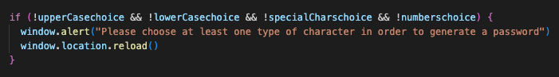
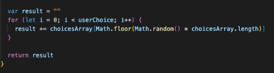

# Password Generator

This project involved modifying the provided starter code to create a web application that allows the user to generate random passwords based on specific criteria they choose. The application uses HTML, CSS and is powered by JavaScript.

## Table of Contents

- Project Overview
- Technologies Used
- Getting Started
- Deployment
- Credits

## Project Overview
The Password Generator is designed to assist users in generating strong and secure passwords that meet their specific requirements. It has the following features:
* Clean and Polished Interface
* Intuitive and Easy Navigation
* Responsive Design

## Technologies Used
JavaScript 

## Getting Started
To begin, I created the generate password function that allows the user to generate a random password. Additionally, I included a log message to ensure functionality when the "Generate Password" button is clicked (see image below).

I then created variables to store the selected criteria (see image below).

Next, I created a window dialog box prompting the user to input their desired chracter count. I set a loop to ensure that the user provided a valid input for the number of character they want in their password. I also added an alert should the user not enter any input, choose to cancel the operation, or make choices outside the set criteria (see image below).

I then set up the remaining prompts to confirm whether or not to include lowercase, uppercase, numeric, and/or special characters. Answers to the prompts are concated into the resulting choiceArray (see image below). 

Here an alert was added if the user chose 'cancel' on all the prompts, whereby the screen would reload to start again (see image below). 

Finally, the password was created by selecting random characters from the array of choices within the loop at the designated length and then returned as the function's output (see image below). 

## Deployment

The application is deployed and can be accessed online. Check it out here: 

https://lepalmer01.github.io/PasswordGenerator/

## Credits
Thank you for the tips and suggestionsm from Bootcamp instructors, learning assistants, classmates, and resources. Thank you to my tutor Sara for assisting me in refining my modified starter code further. I have used http: //www.w3schools.com/ and http://www.stackoverflow.com, and https://chat.openai.com to research information. Lastly,thanks to OpenAI's Chatgpt-4 for assistance in creating this README.md template. 